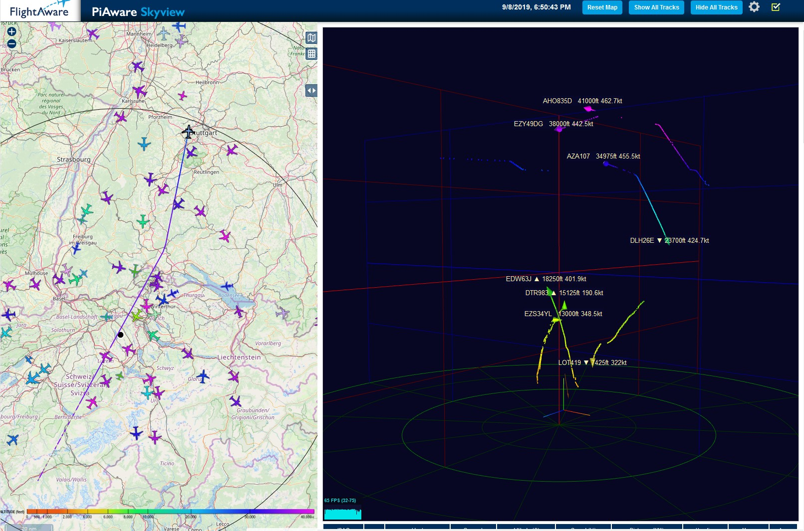

# dump1090-Html 
 dump1090fa SkyView extended 

This is a copy of public_html V3.7.1 [dump1090-fa](https://github.com/flightaware/dump1090)
customized for use in parallel to the original SkyView package.

### Modifications re original dump1090-fa public_html

### Instrument Panel added
Instrument Panel for the selected aircraft, switch between panel and sheet view.
javascript draws on HTML5 Canvas.

### 3D View added
A 3D view of selected aircrafts was added. Switch between panel / 3D view and sheet view.
javascript draws with Three.js .

### geo layers added
Markers for airports and navaids, airways hi/lo and fixes

### sqLite database for aircraft and flights added
This extension uses an sqLite database for aircraft data  
This may be switched of to use the regular db/ from FA by editing the config.js file 

DefaultAircraftDB = true; 

The flights database is only available as sqLite database.

### Screenshot and Video of the Instrument Panel

[Using the dump1090-fa with instrument panel (Youtube link)](https://www.youtube.com/watch?v=mQ3SeIqvK6E)

[Change between Panel and Sheet](doc/screen-changeView.jpg)

[Sheet view](https://raw.githubusercontent.com/bm98/dump1090/master/img/dump1090-fa-Mod3.png)

### How to use

See doc folder:  SetupGuide.pdf
Note: best is to clean the current html_2 folder completely and copy everything from scratch.
 
## Changes
20190823- fix Lat,Lon in panel, disable Test Loop
20190908- added 1st version of a 3d panel 

EOD